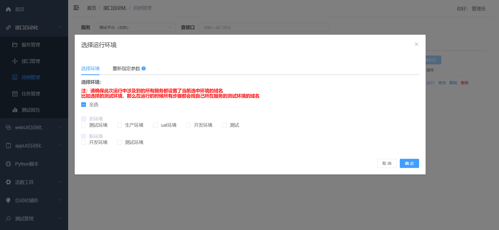
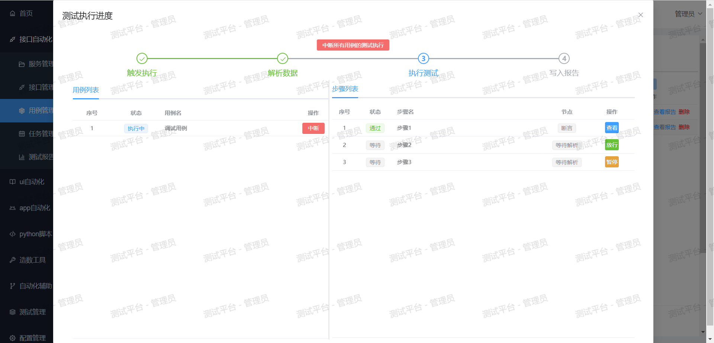
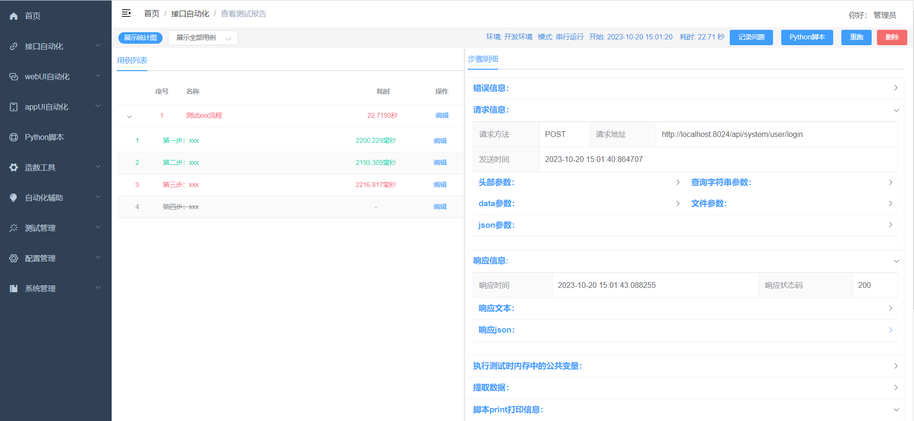

# 测试平台前端 - vue3版本

## [体验demo](http://139.196.100.202/#/login)，账号：admin、密码：123456，请不要修改密码

## [去后端](https://github.com/zhongyehai/test-platform-api)

## 步骤

```bash
# 1.安装node14.x（一定要控制在14.x，版本太高会出一系列幺蛾子），确保在 cmd 下 node -v 能出现版本号
# 2.克隆并进入项目目录
# 3.安装依赖
npm install --registry=https://registry.npm.taobao.org

# 4.启动服务
npm run dev

# 5.打包部署到生产
npm run build
```

浏览器访问 [http://localhost:8023](http://localhost:8023), 账号admin, 密码123456

### 创作不易，麻烦给个星哦

### QQ交流群：249728408

### 博客地址：https://www.cnblogs.com/zhongyehai/

## 项目关键截图

#### 选择运行环境



#### 测试执行进度



#### 测试报告


