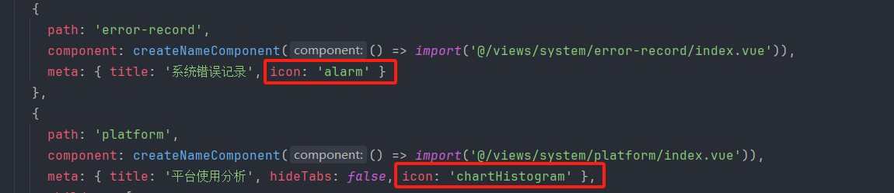

# 测试平台前端 - vue3版本

# 此版本暂停更新，最新更新请移步fastapi版本：https://github.com/zhongyehai/test-platform-fastapi-front

### [体验demo](http://139.196.100.202/#/login) ，账号：admin、密码：123456，请不要修改密码

### [去后端](https://gitee.com/Xiang-Qian-Zou/test-platform-api)

## 步骤

```bash
# 1.安装node18+，确保在 cmd 下 node -v 能出现版本号
# 2.克隆并进入项目目录
# 3.安装依赖
npm install 

或者 
npm install --registry=https://registry.npmmirror.com
# 4.启动服务
npm run dev

# 5.打包部署到生产
npm run build
```

使用 iconpark：https://iconpark.oceanengine.com/official

浏览器访问 [http://localhost:8023](http://localhost:8023), 账号admin, 密码123456

### 创作不易，麻烦给个星哦

### QQ交流群：249728408

### 博客地址：https://www.cnblogs.com/zhongyehai/

## 项目关键截图

#### 选择运行环境


#### 测试执行进度


#### 测试报告


## 在项目中使用iconPark的图标
### 在 https://iconpark.oceanengine.com/official 选择图标，选择复制Vue代码，并复制icon的代码


### 使用icon，如果是多个单词用 "-" 拼接的代码，记得改为驼峰

